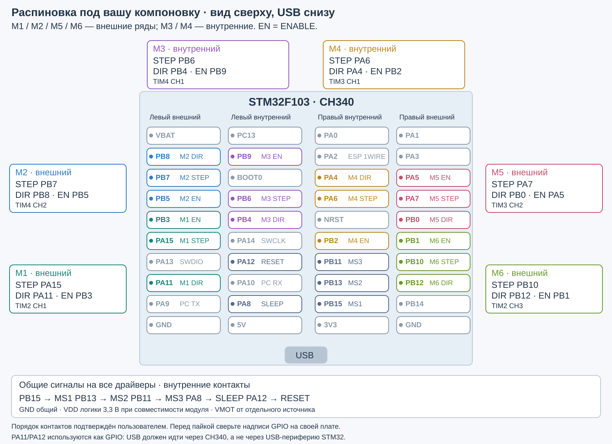

# Music Motor Studio

Музыкальный проигрыватель на STM32F103 и шести STEP/DIR-драйверах HR4998/A4988. ПК редактирует MIDI, распределяет ноты и передаёт события с упреждением; STM32 формирует независимые STEP-частоты. A4 соответствует 440 Гц STEP.

Готовая программа — `MusicMotorStudio.exe` в корне, Python ей не нужен. Выбор COM-порта и используемых моторов — в терминалке. Прошивка: `firmware/MusicMotor.ioc`, проект `firmware/MDK-ARM/MusicMotor.uvprojx`, target `MusicMotor`. Результаты Keil — в `firmware/MDK-ARM/MusicMotor/`.

Вся документация проекта находится здесь:

- [Подключение и компоновка](#wiring)
- [Конфигурация и прошивка](#firmware)
- [Терминалка и состояния](#desktop)
- [MIDI, редактор и воспроизведение](#midi)
- [Распознавание аудио](#audio)
- [UART-протокол](#protocol)
- [Исходники и служебные инструменты](#development)
- [Проверки и ограничения](#validation)

<a id="wiring"></a>
## Подключение и компоновка

Плата: STM32F103C8T6, HSE 8 МГц, CH340 на USART1. Ориентация — вид сверху, USB снизу. Позиции контактов считаются сверху вниз. M1/M2/M5/M6 подключаются к внешним рядам, M3/M4 — к внутренним.



| Мотор | Ряд | Позиции группы | DIR | STEP | ENABLE | Канал STEP |
|---|---|---|---|---|---|---|
| M1 | Внешний левый | 5, 6, 8 | PB3 · поз. 5 | PA15 · поз. 6 | PA11 · поз. 8 | TIM2_CH1 |
| M2 | Внешний левый | 2, 3, 4 | PB8 · поз. 2 | PB7 · поз. 3 | PB5 · поз. 4 | TIM4_CH2 |
| M3 | Внутренний левый | 2, 4, 5 | PB4 · поз. 5 | PB6 · поз. 4 | PB9 · поз. 2 | TIM4_CH1 |
| M4 | Внутренний правый | 3, 4, 6 | PA4 · поз. 3 | PA6 · поз. 4 | PB2 · поз. 6 | TIM3_CH1 |
| M5 | Внешний правый | 3, 4, 5 | PB0 · поз. 5 | PA7 · поз. 4 | PA5 · поз. 3 | TIM3_CH2 |
| M6 | Внешний правый | 6, 7, 8 | PB12 · поз. 8 | PB10 · поз. 7 | PB1 · поз. 6 | TIM2_CH3 |

STEP расположен между DIR и ENABLE по позиции. M1 пропускает PA13/SWDIO, M3 — BOOT0, M4 — NRST. PB2 свободен от обвязки BOOT1 на используемой плате. TIM2 — full remap, TIM3/TIM4 — без remap. JTAG выключен, SWD сохранён.

Общие сигналы соединяются параллельно со всеми драйверами:

| STM32 | Сигнал | Расположение |
|---|---|---|
| PB15 | MS1, бит 0 | Внутренний правый ряд, поз. 9 |
| PB13 | MS2, бит 1 | Внутренний правый ряд, поз. 8 |
| PB11 | MS3, бит 2 | Внутренний правый ряд, поз. 7 |
| PA8 | SLEEP | Внутренний левый ряд, поз. 9 |
| PA12 | RESET | Внутренний левый ряд, поз. 7 |
| GND | Общая земля логики и питания | GND |
| 3.3 V | VDD логики совместимого модуля | 3.3 V |

SLEEP и RESET — отдельные линии. USART1: PA9 TX → RX CH340, PA10 RX ← TX CH340. SWD: PA13 SWDIO, PA14 SWCLK. PA11/PA12 заняты GPIO: USB-периферия самого STM32 не используется, Type-C работает через CH340. На другой версии платы нужно проверить отсутствие соединения PA11/PA12 с D−/D+ разъёма. BOOT0, NRST и PC13 не используются для драйверов.

### Драйверы, питание и микрошаг

Положительный фронт STEP продвигает translator на шаг/микрошаг, DIR задаёт направление. ENABLE разрешает силовые выходы. При ENABLE без STEP обмотки удерживают вал и потребляют ток; автоматического снижения тока в простое нет. Потенциометр модуля задаёт предел тока через VREF, а скорость определяется STEP.

По умолчанию ENABLE, SLEEP и RESET активны нулём. Полярности настраиваются в `config.h`. Для A4988: VDD 3.0–5.5 V, STEP high/low ≥1 мкс, DIR setup/hold ≥200 нс, выход из SLEEP ≥1 мс. Проект использует guard 2 мс и полупериод не короче 125 мкс. Для конкретного HR4998 необходимо сверить таблицу микрошагов, коэффициент VREF/Rsense и допустимые уровни модуля. Источники: [A4988](https://www.pololu.com/file/0J450/A4988.pdf), [STM32F103](https://www.st.com/resource/en/datasheet/stm32f103cb.pdf).

| Режим A4988 | MS1 | MS2 | MS3 | raw | Множитель RPM |
|---|---:|---:|---:|---:|---:|
| Полный шаг | 0 | 0 | 0 | 0 | 1 |
| 1/2 | 1 | 0 | 0 | 1 | 2 |
| 1/4 | 0 | 1 | 0 | 2 | 4 |
| 1/8 | 1 | 1 | 0 | 3 | 8 |
| 1/16 | 1 | 1 | 1 | 7 | 16 |

Сырые комбинации 4, 5, 6 доступны; их множитель для RPM задаётся вручную. При общей шине нельзя выставить разный микрошаг отдельным моторам.

- Обмотки: одна пара → 1A/1B, другая → 2A/2B. Перекоммутация — при отключённом VMOT.
- VMOT — отдельное питание в диапазоне модуля; для отладки подходит 12 V с ограничением тока. У каждого модуля около VMOT/GND — электролит порядка 100 мкФ; при 12 V обычно на 25 V.
- Для A4988 обычно `Itrip = VREF / (8 × Rsense)`; для HR4998 коэффициент нужно проверить. Входной ток питания не равен току обмотки. Начальный ток выбирается по двигателю, дальнейшая настройка — по удержанию, звуку и нагреву.
- Для состояния до старта прошивки: ENABLE каждого драйвера подтянуть примерно 10 кОм к 3.3 V, STEP и общие SLEEP/RESET — к GND. Учесть уже установленные подтяжки модуля. При другой полярности изменить подтяжки.
- Логическое VDD предпочтительно 3.3 V, если модуль это поддерживает: при VDD=5 V уровень GPIO 3.3 V не всегда имеет гарантированный запас.

<a id="firmware"></a>
## Конфигурация и прошивка

| Параметр проекта | Значение |
|---|---|
| МК / память | STM32F103C8T6, 64 КБ Flash / 20 КБ RAM |
| Тактирование | HSE 8 МГц → PLL ×9 → SYSCLK 72 МГц; APB1 36 МГц, TIM2/3/4 72 МГц |
| Таймеры STEP | Счётчик 1 МГц, PSC=71, ARR=65535, Output Compare Toggle |
| UART | USART1, 115200, 8N1 |
| Инструменты проверенной сборки | CubeMX 6.12.1, STM32CubeF1 1.8.7, Keil MDK 5.38, Arm Compiler 6.19 |
| Конфигурация | `firmware/Core/Inc/config.h`, группа **Config** в Keil |
| HEX / AXF / MAP | `firmware/MDK-ARM/MusicMotor/` |

В `config.h` находятся маска моторов, диапазон частот, нота по умолчанию, таймауты, активные уровни, задержки, инверсия DIR и таблица таймеров/каналов. Текущая стартовая маска прошивки — **M2–M5 (0x1E)**; при подключении ПК передаёт маску из своих настроек. `desktop/config.json` содержит исходные значения для новой установки программы, пользовательский JSON имеет приоритет.

Основные константы: `MIN_FREQ_MHZ=20000`, `MAX_FREQ_MHZ=4000000` (20–4000 Гц), `DEFAULT_NOTE=69`, `NOTES_BUFFER_DEPTH=256`, `UART_RING_SIZE=512`, `LINK_TIMEOUT_MS=2000`, `FRAME_TIMEOUT_MS=100`, `STARTUP_DELAY_MS=2`, `RESET_PULSE_MS=2`, `STREAM_START_DELAY_MS=100`. `NOTES_BUFFER_DEPTH` считает **события**, включая START/STOP/END, а не целые ноты. Ёмкость очереди и задержку старта нужно согласовывать с desktop.

GPIO заданы в `.ioc` с метками M1_STEP…M6_STEP, M1_DIR… и общих сигналов. `config.h` ссылается на сгенерированные метки `main.h`. При переносе STEP на другой канал также меняются `M*_TIMER`, `M*_CHANNEL` и распределение `compare_irq()` в `platform_stm32.c`. При изменении активных уровней согласуются начальные GPIO Output Level и внешние подтяжки. Частота счётчиков проверяется при старте.

Для компенсации обратного направления конкретного двигателя — `M1_DIR_INVERT`…`M6_DIR_INVERT`, значения 0/1. Например, `M3_DIR_INVERT=1u` инвертирует физический DIR M3: `physical_DIR = logical_DIR XOR inversion`. В UART/GUI остаётся логическое направление. Это не независимое управление токами фаз: смешанные пары проводов обмоток нужно исправлять физически; одновременный переворот обеих обмоток не эквивалентен смене DIR.

### Генерация STEP и сохранение пользовательского кода

`main.c`, HAL MSP и обработчики периферии сгенерированы CubeMX. Прикладные `engine.c`, `protocol.c`, `platform_stm32.c`, `config.h` не генерируются. Вызовы и прямые IRQ размещены в USER CODE. Для TIM2/3/4 и USART1 вызов тяжёлого HAL handler выключен; SysTick обслуживает миллисекундный счётчик HAL. Повторная генерация с сохранением этих частей проверена.

Каждый канал назначает следующий CCR относительно предыдущего:

```text
half = round(timer_Hz / (2 × STEP_Hz))
CCR_next = (CCR_previous + half) mod 65536
actual_STEP_Hz = timer_Hz / (2 × half)
RPM = actual_STEP_Hz × 60 / (steps_per_revolution × microstep)
```

При 1 МГц A4 даёт half=1136 и 440.140845 Гц; UART передаёт 440141 мГц. Полупериод должен оставаться меньше 32768 отсчётов; нижние частоты за этим пределом требуют другого алгоритма. IRQ программирует следующий CCR с запасом не менее 8 отсчётов, пропуск срока вызывает OVERRUN и остановку.

Новая частота применяется после спада STEP, без короткого высокого импульса. STOP замораживает OC, выдерживает 3 мкс и принудительно держит STEP низким. DIR меняется только после остановки; перед START действует guard 2 мс. Фронты аппаратные, музыкальные события планируются с разрешением 1 мс в основном цикле. TIM IRQ имеют высший приоритет; USART использует отдельные RX/TX-кольца. Динамического выделения памяти в прошивке нет.

После сброса и подключения программы: STEP low, ENABLE выключены, SLEEP/RESET активны, автоматического проигрывания нет. Неполные/повреждённые команды не запускают двигатель. Потеря связи, аппаратная UART-ошибка и опустевшая очередь без END вызывают аварийную остановку.

<a id="desktop"></a>
## Терминалка и состояния

В «Настройках» выбираются используемые моторы, названия, полные шаги на оборот и направления. Отображаются только выбранные карточки с сохранением номеров: например, M2–M5. Та же маска ограничивает распределение музыки. Симулятор доступен только служебным проверкам, переключателя в обычном интерфейсе нет.

Соединение — выбранный COM-порт CH340; скорость должна совпадать с прошивкой. PING отправляется автоматически, состояние запрашивается примерно раз в 100 мс. Во вкладке UART видны TX, ACK/NAK и ошибки.

Ручной запуск: снять общие RESET и SLEEP, задать частоту/ноту и DIR, включить индивидуальный ENABLE, нажать STEP. Изменение частоты само по себе не запускает остановленный канал. Stop прекращает STEP; STOP ALL останавливает композицию, отключает все ENABLE и активирует SLEEP/RESET. RESET PULSE делает общий сброс без автоматического запуска.

| Отображение мотора | Значение |
|---|---|
| Красная заливка | Ошибка команды или связи |
| Зелёная заливка | Генератор STEP активен |
| Без заливки | STEP остановлен, ENABLE выключен/удержание, SLEEP, RESET или нет соединения; состояние указано текстом |

«Драйвер отключён» означает неактивный ENABLE, а не отсутствие модуля. При ENABLE без STEP двигатель удерживает положение. Частота и RPM после Stop показывают последнюю настройку; это не измерение вращения. Обратной связи от драйверов и датчиков нет.

Настройки EXE: `%APPDATA%/MusicMotorStudio/settings.json`; исходников: `desktop/user_settings.json`; начальные значения: `desktop/config.json`. Настройки сохраняются при обновлении EXE. Сохранение конфигурации не запускает STEP.

<a id="midi"></a>
## MIDI, редактор и воспроизведение

### MIDI и партии

Откройте MIDI во вкладке редактора. Партию определяет сочетание дорожка + MIDI-канал + программа. Смена Program Change создаёт другую партию, даже внутри той же дорожки. GM в списке — номер инструмента **1–128** (в файле 0–127). Каналы в GUI — 1–16, ударный — 10. Velocity используется при выборе нот, не задаёт ток или громкость драйвера.

Галочка партии разрешает её воспроизведение; поле M назначает конкретный мотор либо «Авто». Транспонирование партии и всей композиции применяется при распределении, исходные ноты не уничтожаются. Ударные по умолчанию выключены: для включения нужны и флаг партии, и разрешение ударного канала во вкладке воспроизведения.

Карта темпа сохраняется при импорте/экспорте. Ползунок процента темпа равномерно ускоряет/замедляет карту. Поддерживаются MIDI type 0/1 и PPQN; type 2 и SMPTE отклоняются с объяснением. Pitch bend, CC64 sustain, aftertouch, SysEx, эффекты и контроллерная автоматизация не преобразуются в STEP и не сохраняются как исходный MIDI-поток. Длительность — от Note On до соответствующего Note Off. Это редактор нот, а не полный DAW.

«Сохранить MIDI» сохраняет отредактированные исходные ноты, все партии и карту темпа. «Экспорт для моторов» сохраняет фактически распределённый вариант: только звучавшие участки, транспонирование/темп/октавные переносы, отдельная дорожка на каждый двигатель. «Сохранить проект» в `.motor.json` сохраняет также флаги партий, ручные назначения и их транспонирование. Настройки всей установки хранятся отдельно в пользовательском JSON.

### Piano roll

- Щелчок выделяет ноту; Ctrl+щелчок — несколько, рамка на пустом месте — группу.
- Двойной щелчок на пустом поле добавляет ноту в выбранную партию; на ноте открывает velocity.
- Перетащите ноту для изменения времени/высоты. Выделенные ноты перемещаются группой с ограничением границ 0–127 и начала композиции.
- Перетащите правый край для изменения длительности. Минимум — текущая сетка.
- Delete/Backspace удаляет выделенное. Undo/Redo и Ctrl+Z/Ctrl+Y отменяют/возвращают нотные правки.
- Поле velocity и кнопка рядом применяют значение ко всему выделению.
- «Выделенные ноты → новая партия» позволяет вручную разделять группы.
- Клавиатура слева и линейка сверху закреплены при прокрутке. Сетка подписана в долях и тактах условного 4/4; время воспроизведения определяется реальной картой темпа, а не этой подписью.
- Горизонтальный масштаб задаётся слайдером. Полосы прокрутки перемещают видимую область.

При выборе партии остальные отображаются приглушённо. После пересчёта назначений цвета относятся к моторам; при достаточной ширине ноты подписаны M1–M6. Белая обводка показывает текущее звучание. Отброшенные/прерванные ноты красные с диагональю; hover и список слева показывают причину. При stealing красной отмечается вся исходная нота, а фактический сыгранный участок хранится отдельно и попадает в экспорт для моторов. Во время музыки редактирование заблокировано; после Stop снова доступно.

### Распределение и воспроизведение

Доступные моторы задаются общей настройкой «Использовать». Реальная полифония = минимум выбранного ограничения и числа доступных моторов. Ручное назначение партии недоступному мотору даёт пропуск, не замену молча на другой канал.

Стратегии:

| Стратегия | Поведение |
|---|---|
| Стабильная | Сохраняет удерживаемые ноты до конца; свободный мотор выбирается по близости предыдущей высоты. Более громкая новая нота может вытеснить тихую. |
| Мелодия + бас | На одновременных атаках сначала крайние верхняя и нижняя ноты, затем средние по velocity. |
| Самые громкие | Приоритет velocity, затем высоты. |
| Верхние / нижние | Приоритет высоты вверх / вниз. |
| Выбранные партии | Приоритет порядку включённых партий в списке, затем velocity. |
| Ручное назначение | Только партии с конкретным M; конфликты одного M решаются приоритетом velocity. |

Любое явное назначение M учитывается и в автоматических стратегиях. После stealing старый Note Off не выключит новую ноту. Отброшенная нота не начинает звучать с середины позже; пересчитывается новый MIDI-план при следующем запуске. Алгоритм не пытается распознавать музыкальную мелодию семантически.

Диапазон STEP 20–4000 Гц можно сузить. Перенос по октавам сохраняет класс ноты и выбирает ближайшую допустимую октаву. Если такой ноты нет, она пропускается. При выключенном переносе все выходящие за диапазон ноты пропускаются.

Play сначала останавливает предыдущий поток, задаёт маску, микрошаг, направления, снимает общие SLEEP/RESET, включает ENABLE выбранных каналов, заполняет очередь и только потом запускает таймлайн. При отсутствии соединения программа сообщает об ошибке и не переключается в симуляцию.

Pause отправляет STREAM_STOP, очищает очередь и запоминает последнюю подтверждённую позицию. Resume загружает оставшиеся события и заново включает ноты, которые должны удерживаться в этой позиции. Из-за телеметрии 100 мс точность точки паузы ограничена этим интервалом; возобновление имеет стартовый guard 100 мс. Это музыкальная пауза, не sample-accurate аудиотранспорт.

Во время воспроизведения меняются карточки, счётчик времени, очередь и playhead. При окончании STOP применяется настройка отключения ENABLE. STOP ALL всегда отключает ENABLE, независимо от настройки.

<a id="audio"></a>
## Распознавание аудио

WAV/MP3/FLAC/OGG и другие форматы декодируются libsndfile или FFmpeg. В готовый EXE FFmpeg включён; ручной путь в настройках имеет приоритет. Обработка выполняется в QThread. Результат сначала виден в отдельном piano roll, затем переносится в MIDI-редактор для исправлений и экспорта. Максимальная длительность файла — 20 минут.

| Движок | Назначение и ограничения |
|---|---|
| Спектральные пики | Встроенный полифонический анализ: mono 22050 Гц, STFT 4096, hop 256, спектральные максимумы, подавление части гармоник, объединение и фильтрация коротких нот. Гармоники, шум, вокал и ударные могут превращаться в ложные ноты. |
| librosa pYIN | Одноголосная оценка основного тона; подходит для отдельной мелодии. Увеличение параметра полифонии не делает pYIN многоголосным. В EXE Numba JIT отключён, поэтому обработка может быть медленнее. |
| Basic Pitch | Опциональный внешний `basic-pitch.exe`; путь задаётся в настройках. Движок устанавливается отдельно от Python 3.7 терминалки. Адаптер реализован, реальный нейросетевой inference здесь не проверялся. [Репозиторий движка](https://github.com/spotify/basic-pitch). |

Настройки анализа: диапазон MIDI, число голосов, чувствительность и минимальная длительность. Для спектрального алгоритма стартовые значения — порог 0.25, минимум 100 мс, до четырёх голосов, ноты 36–96. Меньший порог даёт больше кандидатов и ложных нот. Velocity оценивается по амплитуде. Получается условная партия «Аудио» с темпом отображения 120 BPM; это не определённый темп исходной записи.

Аудиоразделение приблизительное: достоверного выделения инструментов, вокала, баса и ударных из готового микса нет. Обычный MIDI уже содержит дорожки/каналы; аудио сначала приходится распознавать, затем исправлять вручную.

<a id="protocol"></a>
## UART-протокол v1

Физический канал: **USART1 PA9/PA10, 115200 бод, 8 data bits, no parity, 1 stop bit**, без flow control. Все многобайтовые числа **little-endian**. Двигатели в пакетах имеют номера **0–5** (GUI M1–M6). Частоты передаются целыми **миллигерцами**, 440 Гц = 440000.

### Кадр

| Смещение | Размер | Поле |
|---:|---:|---|
| 0 | 2 | Sync: `A5 5A` |
| 2 | 1 | L: длина payload, 0–240 |
| 3 | 1 | Sequence, 0–255 |
| 4 | 1 | Command |
| 5 | L | Payload |
| 5+L | 2 | CRC low, high |

Общая длина L+7. **CRC-16/CCITT-FALSE**: poly=0x1021, init=0xFFFF, refin=false, refout=false, xorout=0. CRC охватывает байты `L, seq, command, payload`, не включает sync/CRC. Контрольный вектор `123456789 → 0x29B1`.

Стандартный ответ: command=**0x80 ACK** или **0x81 NAK**, seq повторяет запрос. Payload ответа: `[original_command:u8, error:u8, response_data...]`. Для ACK error=0. NAK не имеет дополнительных данных. GET_INFO/GET_STATUS возвращают данные внутри ACK, отдельного кода телеметрии нет.

ПК держит **один неподтверждённый запрос**, увеличивает seq по модулю 256. Timeout ACK=250 мс, всего три попытки с **точно тем же кадром/seq**. STM32 кеширует последний полностью совпадающий запрос и ответ на 1000 мс: повтор возвращает ответ без повторного добавления событий или сброса таймлайна. После успеха следующий запрос должен иметь другой seq. GET_STATUS с новым seq возвращает новое состояние.

CRC-ошибка не получает NAK: номер seq тоже мог быть повреждён. Парсер сбрасывает один байт и ищет sync заново. L>240 отклоняется. Неполный кадр с межбайтовой паузой >100 мс забывается. Если испорченная длина удерживает более поздний кадр, после 100 мс ПК повторяет запрос. Заголовок внутри payload допустим, специального escaping нет. Незавершённый/CRC-повреждённый пакет никогда не передаётся обработчику команд.

Аппаратная UART overrun/framing/noise/parity error или переполнение RX/TX → аварийная остановка. CRC/length/некорректная команда сохраняют код ошибки и счётчик, но не запускают двигатель. Приложение при NAK отменяет всю оставшуюся последовательность настройки и отправляет E-stop. Успешный E-stop очищает текущий код ошибки, счётчик faults сохраняется. Потеря корректных команд >2 с при включённом ENABLE или потоке → E-stop с TIMEOUT. ПК отправляет PING каждые 500 мс.

### Команды

`m` — motor u8, `b` — логическое u8 0/1, `f` — u32 mHz. Значение b=1 для SLEEP/RESET означает **активировать функцию**, независимо от электрической полярности.

| Код hex / dec | Команда | Payload | Response data |
|---|---|---|---|
| 01 / 1 | PING | пусто | ASCII `OK` |
| 02 / 2 | GET_INFO | пусто | ASCII версия/протокол/число каналов/таймер/ёмкость |
| 03 / 3 | GET_STATUS | пусто | 52 байта, ниже |
| 04 / 4 | EMERGENCY_STOP | пусто | пусто |
| 05 / 5 | SET_MASK | u8 mask, биты 0–5 | пусто |
| 06 / 6 | ENABLE | m,b | пусто |
| 07 / 7 | START | m | пусто |
| 08 / 8 | STOP | m | пусто |
| 09 / 9 | FREQUENCY | m,f | пусто |
| 0A / 10 | NOTE | m,note u8 0–127 | пусто |
| 0B / 11 | DIR | m,b | пусто |
| 0C / 12 | MICROSTEP | u8 raw 0–7 | пусто |
| 0D / 13 | SLEEP | b | пусто |
| 0E / 14 | RESET | b | пусто |
| 0F / 15 | RESET_PULSE | пусто | пусто |
| 10 / 16 | STREAM_START | пусто | пусто |
| 11 / 17 | STREAM_STOP | b: отключать ENABLE | пусто |
| 12 / 18 | EVENTS | 1–24 событий × 10 байт | u16 free_slots |
| 13 / 19 | CLEAR | пусто | пусто |
| 14 / 20 | QUEUE | пусто | u16 free_slots |

SET_MASK задаёт точные установленные двигатели, а не только количество; количество — popcount(mask). При исключении канала STEP останавливается, ENABLE выключается; очередь очищается. В процессе потока менять маску нельзя. В текущем GUI общая настройка используемых моторов задаёт и доступность ручного управления, и участие в распределении музыки; отдельного флага на карточке нет.

START требует установленного двигателя, включённого ENABLE, снятых SLEEP/RESET и истёкшего guard. FREQUENCY/NOTE меняют настройку, но **не запускают** остановленный канал. На работающем канале новая частота применяется после следующего falling edge. Значение фактической частоты читается GET_STATUS. DIR разрешён только после STOP, затем выдерживается 2 мс. MS можно менять только когда все STEP остановлены. RESET_PULSE останавливает поток/STEP, держит общий RESET 2 мс, снимает его и добавляет 2 мс guard; SLEEP не меняется, автоматического старта STEP нет.

В потоке индивидуальные ENABLE/START/STOP/FREQUENCY/NOTE/DIR запрещены. Используйте STREAM_STOP/EMERGENCY_STOP; GUI индивидуальная кнопка Stop во время музыки останавливает композицию. Активация общего SLEEP/RESET останавливает STEP и очищает очередь, но сама по себе не меняет ENABLE. E-stop дополнительно отключает все ENABLE и активирует оба общих сигнала.

### Музыкальные события

| Смещение в событии | Формат | Значение |
|---:|---|---|
| 0 | u32 | at_ms от начала потока |
| 4 | u8 | motor 0–5, или 255 для END |
| 5 | u8 | op: 0 STOP, 1 START/UPDATE, 2 END |
| 6 | u32 | Частота mHz для op=1, иначе строго 0 |

Время 0–86400000 мс (сутки), не убывает между событиями и пакетами. Одинаковое время разрешено, исполнение FIFO. Для замены нот одного канала отправляйте STOP перед START на том же времени. При активном потоке запрещено добавлять события уже в прошлом. Весь EVENTS-пакет сначала проверяется, затем целиком фиксируется в очереди; частичного добавления при ошибке нет.

Буфер содержит 256 событий. START/UPDATE не включает ENABLE: подготовьте драйверы заранее. END имеет motor=255/value=0, разрешён только последним событием. Последующие события после END отклоняются до CLEAR/STOP. END останавливает все STEP и поток; ENABLE остаются, затем ПК применяет настройку «отключать после остановки». Если связь оборвалась, watchdog также отключит ENABLE.

Пустая очередь во время потока **не считается успешным концом**: это UNDERRUN, STEP и ENABLE выключаются, SLEEP/RESET активируются. Для длинной тишины можно заранее передать событие с далёким at_ms; пустая пауза не требует фиктивных STEP.

Перед STREAM_START очередь должна быть непуста. Начало таймлайна назначается на 100 мс после принятия команды. ПК заполняет примерно до горизонта 1500 мс либо примерно 192 слотов; sparse-поток содержит и следующее событие за горизонтом. Пополнение идёт пакетами до 24 событий, состояние запрашивается примерно каждые 100 мс. Сотни событий/с возможны, но конечный буфер и UART не гарантируют работу произвольно плотного MIDI. При исчерпании всё останавливается с явной ошибкой.

Пример последовательности:

```text
EMERGENCY_STOP
SET_MASK 0x0F
MICROSTEP 0
RESET 0, SLEEP 0
для выбранных M: DIR, ENABLE 1
выдержать ≥2 мс после последнего DIR / выхода из сна
CLEAR
EVENTS: (0,0,START,440000), (1000,0,STOP,0), (1002,255,END,0)
STREAM_START
PING / GET_STATUS / дальнейшие EVENTS
STREAM_STOP(disable_after_stop)
```

### GET_STATUS — 52 байта

| Offset | Формат | Поле |
|---:|---|---|
| 0 | u8 | installed_mask |
| 1 | u8 | sleep active |
| 2 | u8 | reset active |
| 3 | u8 | raw microstep |
| 4 | u8 | stream running |
| 5 | u8 | last error |
| 6 | u16 | used slots 0–256 |
| 8 | u32 | position_ms |
| 12 | u32 | fault counter |
| 16+6m | u8 | flags: bit0 ENABLE, bit1 STEP active, bit2 DIR |
| 17+6m | u8 | note; 255=ручная частота, нота не задана |
| 18+6m | u32 | Фактически заданная/округлённая STEP частота, mHz |

Для музыкального START/UPDATE note — ближайшая равномерно темперированная нота. Частота остаётся в статусе и после STOP как последняя настройка; наличие частоты **не означает** генерацию STEP. Флаг STEP показывает состояние генератора, не наличие физического вращения. При частотном обновлении статус сообщает принятую настройку; аппаратное применение ожидает falling edge, максимум один старый полный период.

### Ошибки

0 OK; 1 LENGTH; 2 COMMAND; 3 VALUE; 4 STATE; 5 FULL; 6 ORDER; 7 CRC; 8 TIMEOUT; 9 UART; 10 UNDERRUN; 11 OVERRUN (пропущен срок программирования следующего CCR).

Парсер не является криптографической аутентификацией. Протокол предназначен для локального UART с доверенным ПК.

<a id="development"></a>
## Исходники и служебные инструменты

| Путь | Содержимое |
|---|---|
| `firmware/Core` | Прикладная прошивка и конфиги |
| `firmware/Drivers` | HAL/CMSIS с исходными лицензиями |
| `firmware/MDK-ARM` | Keil, startup; результаты в подпапке target |
| `desktop/app`, `desktop/widgets` | Интерфейс, настройки, потоковое воспроизведение, карточки и piano roll |
| `desktop/midi` | Модель MIDI, карта темпа, распределитель |
| `desktop/audio` | Транскрипция и совместимость библиотек |
| `desktop/protocol` | Кадры, UART-клиент, симулятор |
| `desktop/examples` | `clockwork.mid`, проект `clockwork.motor.json`, тестовый `test_tone.wav` |
| `_service` | Локальные инструменты, тесты, зависимости, сборки и отчёты; для обычной работы не нужна |

Версия исходников — **Python 3.7 x64 / PySide2 5.15.2.1**. Зависимости закреплены в `desktop/requirements.txt` и `desktop/requirements-audio.txt`. Точка входа — `desktop/run.py`; `Запустить.cmd` использует локальный `_service/python37` без активации окружения. Пользователю готового EXE эти зависимости не нужны.

Локальная сборка Nuitka 4.2.1 / MSVC 14.3:

```powershell
_service/python37/Scripts/python.exe -B _service/tools/build_desktop.py --onefile
```

Скрипт включает Qt, численные библиотеки, FFmpeg, конфигурацию и примеры. Промежуточные файлы — `_service/build/nuitka`, готовый EXE копируется в корень. `Basic Pitch` остаётся внешним. Служебная проверка EXE — `_service/tools/check_exe.py`, общий тестовый скрипт — `_service/tools/run_tests.ps1`.

`_service`, EXE, результаты Keil, кэши, пользовательские настройки и настройки рабочего окна Keil исключены через `.gitignore`. `_service` — локальный набор, поэтому её окружение, тесты и скрипты не появляются в чистом клоне Git. Исходники приложения, прошивки, проекты, библиотеки, конфиги по умолчанию и примеры входят в репозиторий.

Модель MIDI хранит время в четвертях, карта темпа переводит его в секунды, allocator — в миллисекунды. По UART отправляется готовое назначение частот моторам, а не исходный MIDI. Слои прошивки: `protocol.c` → `engine.c` → `platform_stm32.c`; обработка команд и очередь выполняются в main, фронты STEP — аппаратно.

Обработчики ENABLE/DIR/NOTE в `MotorCard` намеренно подключены отдельными замыканиями на каждый экземпляр. В используемой связке Nuitka/PySide2 привязка одного метода разных экземпляров могла направлять все карточки в M1; обработчики также допускают отсутствие аргументов Qt-сигнала. При изменении этих связей нужна проверка готового EXE на всех моторах, включая маску с исключённым M1.

<a id="validation"></a>
## Проверки и ограничения

Последняя проверка терминалки: **18 тестов GUI/settings/streaming прошли**. Готовый onefile EXE проверен из отдельной папки без Python в PATH: управление M2–M5 с исключённым M1, RESET/SLEEP/ENABLE/DIR/NOTE, цвета, редактор, play/pause/resume, импорт/экспорт MIDI, аудио в QThread, FFmpeg M4A и librosa pYIN. Отдельный скомпилированный тест проверил адресацию всех шести карточек. Это изолированный запуск на текущем компьютере, не чистая виртуальная машина.

Ранее проверены математика частот/RPM, переполнение таймеров, CRC/ресинхронизация, очередь, распределение 1–6 голосов, note stealing, маски, транспонирование и октавный перенос. Host DLL использует настоящие `engine.c`/`protocol.c` с заменой периферии; симулятор повторяет UART-состояния, но не электрические фронты. История прогонов и снимки интерфейса находятся в локальной `_service/reports`.

Последняя проверенная пересборка Keil: 0 ошибок и предупреждений, ROM 13 776 байт, RAM 7 456 байт со стеком 2048, heap=0. Повторная генерация CubeMX сохраняет прикладные файлы, группу Config и USER CODE.

По журналам реальной платы подтверждены ответы UART, но автоматические проверки GUI проводились с симулятором. Не измерены осциллограммы STEP, запас IRQ при 6 × 4000 Гц, реальные уровни и подтяжки платы, токи, нагрев и звук. Программа знает состояния команд и генераторов, а не физическое вращение. Аудиотранскрипция остаётся приблизительной.
