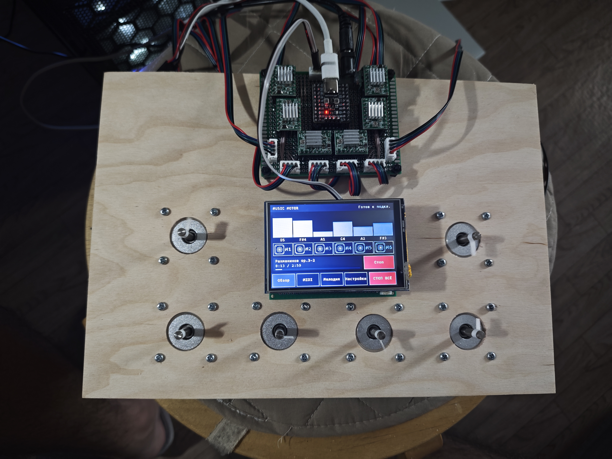
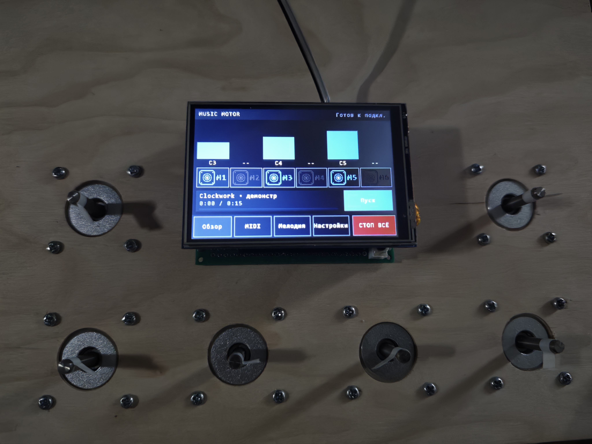
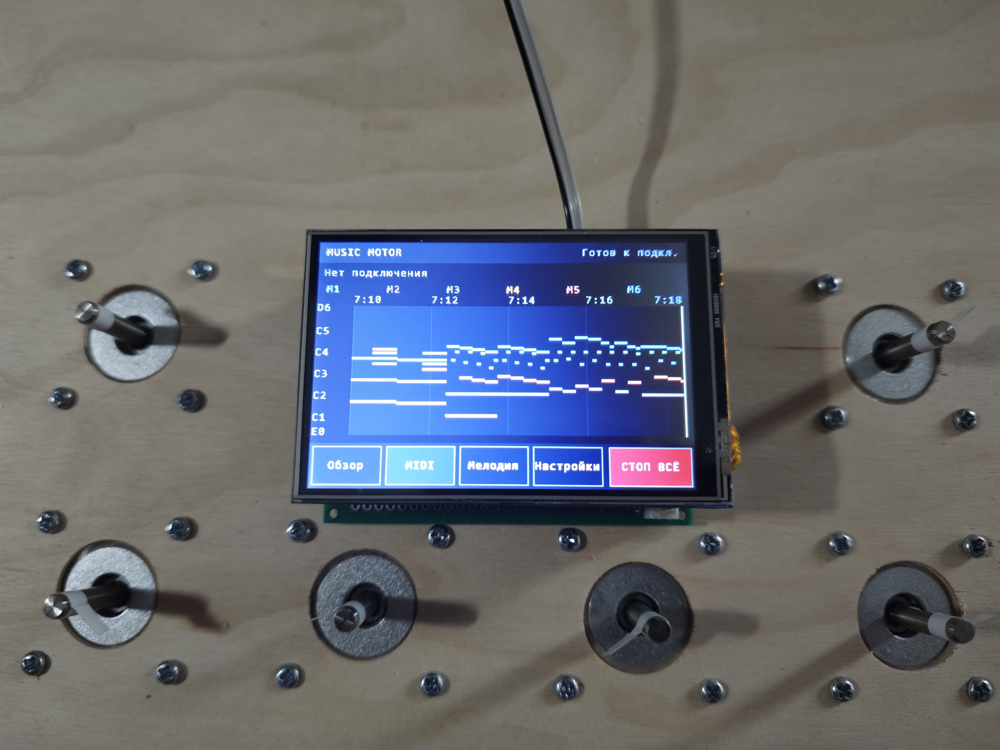
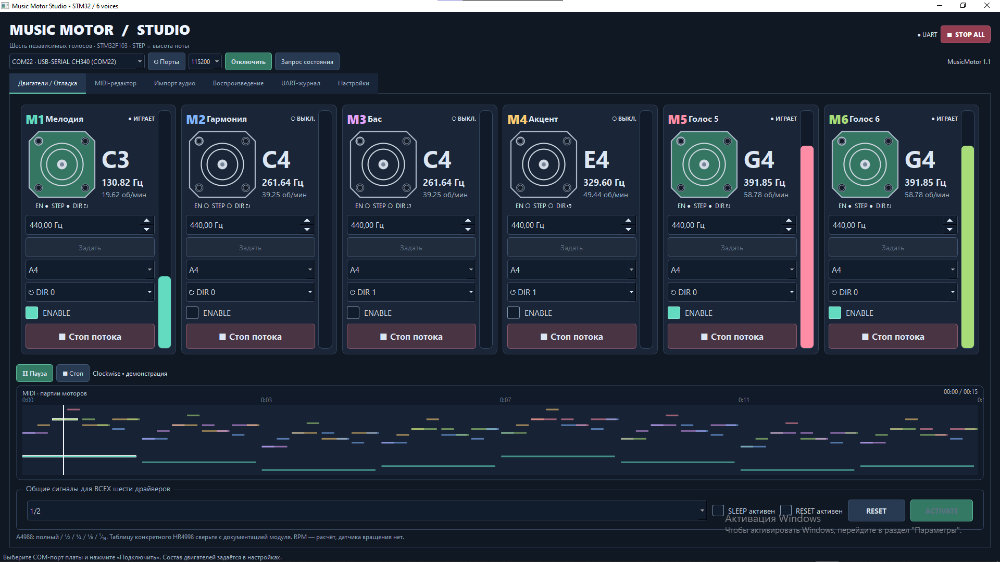

# Музыка на шаговых двигателях

Электромеханический музыкальный инструмент: шесть шаговых двигателей играют разные партии мелодии. Звук создают сами моторы — без динамиков. Управлять устройством можно с компьютера, через USB-MIDI или с сенсорного экрана, выбирая песни из памяти.

## Устройство и интерфейс

<!-- Положить изображения по указанным путям или заменить ссылки адресами загруженных файлов. -->

*Шесть моторов играют музыку, сенсорный экран управляет воспроизведением.*

*Главный экран — состояние моторов и управление воспроизведением.*

*MIDI — игра на моторах с подключённого MIDI-инструмента.*

*MusicMotorStudio — загрузка MIDI, распределение партий по моторам и управление устройством.*

## Видеодемонстрация

<!-- Заменить VIDEO_URL ссылкой на видео, например на Яндекс Диске или YouTube. -->

[▶ Смотреть воспроизведение мелодии на моторах](VIDEO_URL)

## Как это работает

Частота шагов двигателя задаёт высоту ноты, а длительность движения — её продолжительность. Несколько моторов позволяют воспроизводить мелодию и аккомпанемент одновременно.

STM32 формирует импульсы STEP аппаратными таймерами. ESP32 отвечает за дисплей, USB-MIDI и хранение мелодий. Программа MusicMotorStudio подготавливает MIDI и распределяет ноты между моторами.

## Что реализовано

- воспроизведение MIDI на шести независимых моторах;
- живая игра с USB-MIDI-инструмента;
- подготовка мелодий и управление воспроизведением из MusicMotorStudio;
- сохранение до четырёх мелодий в устройстве через подключённую к ПК STM32;
- автономное воспроизведение, выбор песни и перемотка с сенсорного экрана;
- ручное управление моторами с отображением ноты и частоты;
- индикация подключения USB/MIDI и состояния моторов;
- последовательная проверка моторов аккордом при включении;
- общая кнопка остановки всех моторов.

## Аппаратная часть

Устройство построено на STM32F103 и ESP32-S3. Моторы подключаются через драйверы STEP/DIR. Платы связаны однопроводным UART: GPIO4 ESP32 — PA2 STM32, общий GND, скорость 230400 бод.

[Схема подключения моторов](firmware/wiring-layout.svg).

## Использование

На компьютере открыть **MusicMotorStudio.exe**, подключить STM32 и выбрать MIDI. Во вкладке «Воспроизведение» можно запустить песню или нажать «Сохранить в устройство», выбрав одно из четырёх мест.

На дисплее песня выбирается во вкладке **«Мелодия»**, а запускается через **«Обзор → Пуск»**. Шкала позволяет перематывать песни с ПК и из памяти. **«СТОП ВСЁ»** останавливает все моторы.

## Структура проекта

- `firmware/` — прошивка STM32, конфигурация CubeMX и проект Keil;
- `esp32-diplsay-midi/` — подмодуль с прошивкой ESP32 и интерфейсом дисплея;
- `desktop/` — исходники MusicMotorStudio;
- `MusicMotorStudio.exe` — готовое приложение для Windows.

## Сборка и прошивка

**STM32:** открыть `firmware/MDK-ARM/MusicMotor.uvprojx` в Keil, собрать и прошить. Готовый HEX находится в `firmware/MusicMotor.hex`.

**ESP32:** открыть `esp32-diplsay-midi/Firmware/ESP32` в VS Code с PlatformIO, выбрать окружение `display` и выполнить Upload. При клонировании репозитория загрузить подмодуль: `git submodule update --init --recursive`.

## Технологии

`STM32F103` · `ESP32-S3` · `C / C++` · `STM32 HAL` · `ESP-IDF` · `USB-MIDI` · `UART` · `Python / PySide2` · `Keil MDK` · `PlatformIO`
